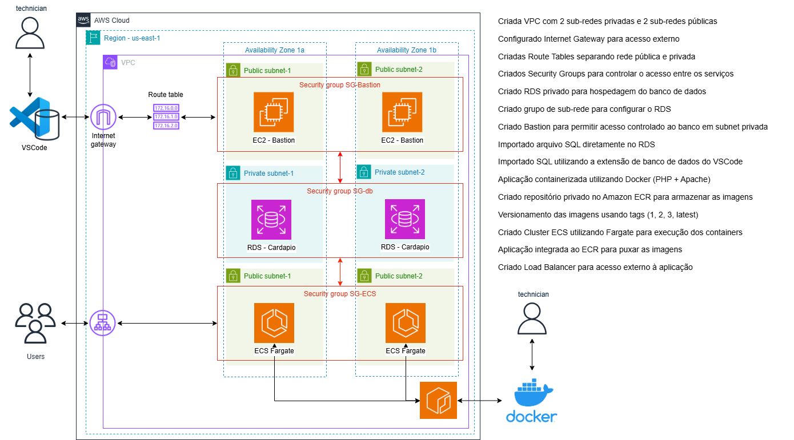

# 🍔 Cardápio Online - Projeto Completo em AWS com Docker, ECR e ECS

---

## 📌 Sobre o Projeto

Este projeto demonstra a construção completa de uma aplicação **containerizada (Docker)** hospedada na **AWS**, utilizando boas práticas de arquitetura em nuvem.

O objetivo foi criar um ambiente **real de produção**, incluindo:

- Infraestrutura em VPC
- Banco gerenciado no RDS (MySQL)
- Containers versionados no ECR
- Execução serverless com ECS Fargate
- Acesso controlado via Bastion
- Deploy baseado em imagens Docker

---

## 🧩 Arquitetura do Projeto

### Componentes

- VPC com isolamento de rede
- Subnets públicas e privadas
- Internet Gateway
- Security Groups
- Bastion Host (EC2)
- RDS MySQL (privado)
- ECS Fargate
- Application Load Balancer
- Amazon ECR (repositório de imagens)

---

## ☁️ Infraestrutura AWS

- Criada VPC com 2 sub-redes privadas e 2 públicas  
- Configurado Internet Gateway  
- Criadas Route Tables pública e privada  
- Criados Security Groups para controle de acesso  
- Criado RDS MySQL privado  
- Criado Subnet Group para o RDS  
- Criado Bastion Host para acesso seguro ao banco  
- Importado banco via arquivo SQL  
- Importado banco via VSCode (extensão MySQL)  

---

## 🐳 Docker e Containerização

A aplicação foi containerizada utilizando:

- PHP + Apache
- Conexão com banco MySQL
- Variáveis de ambiente
- Build de imagem Docker
- Versionamento de imagens

### Versionamento de imagens

As imagens são armazenadas no **Amazon ECR** usando tags:

1 → Primeira versão estável  
2 → Segunda versão  
3 → Atualização da aplicação  
latest → Última versão ativa  

---

## 📦 Amazon ECR (Container Registry)

Foi criado um **repositório privado no Amazon ECR** para armazenar as imagens Docker.

Fluxo:

1. Login no AWS CLI  
2. Build / Commit da imagem Docker  
3. Tag da imagem  
4. Push para o ECR  
5. Versionamento por tags  

---

## 🚀 ECS Fargate (Execução Serverless)

A aplicação roda em **ECS Fargate**, sem necessidade de gerenciar servidores.

- Cluster ECS criado  
- Task Definition usando imagem do ECR  
- Containers rodando em subnet privada  
- Comunicação com RDS  
- Load Balancer para acesso público  

---

## 🗄️ Banco de Dados

### Ambiente Local
- MySQL via XAMPP  
- phpMyAdmin  
- Importação de SQL  

### Produção
- Amazon RDS MySQL  
- Acesso via Bastion  
- Banco privado  

---

## 🔐 Segurança

- Banco em subnet privada  
- Acesso somente via Bastion  
- Security Groups controlando portas  
- Containers isolados  
- Repositório ECR privado  

---

## 🌐 Acesso

Aplicação publicada via ECS Fargate + Load Balancer.

---

## ▶️ Vídeo do Projeto

Youtube: https://youtu.be/ApSGURTDMLI

Linkedin: https://www.linkedin.com/in/luiz-inhesta-341b4b311/

---

## 👨‍💻 Autor

**Luiz Augusto**  

Projeto prático focado em Cloud, Docker, DevOps e AWS.
